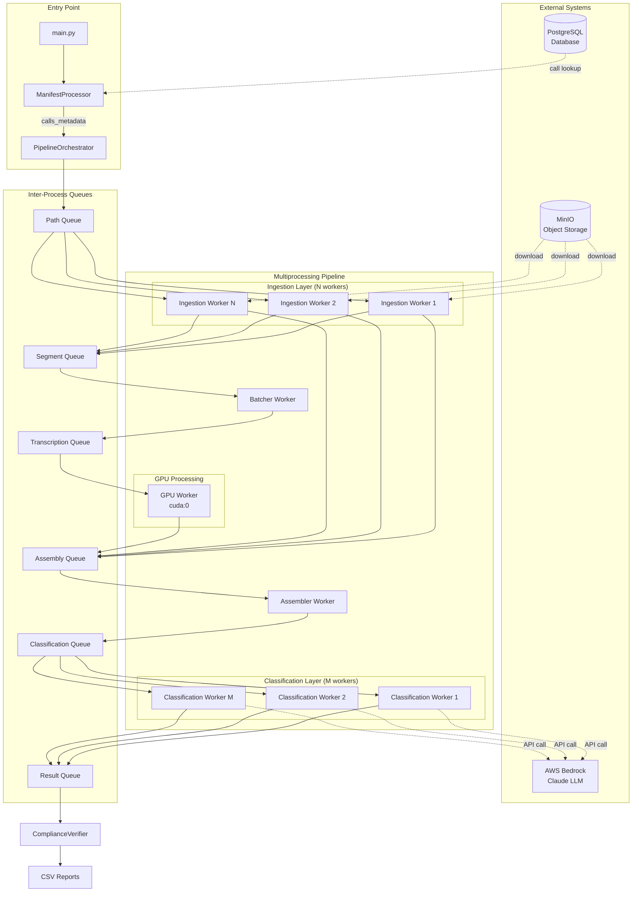

# Audio Compliance Verification Pipeline

A high-performance, multiprocessing-based audio processing pipeline for verifying telecom call compliance. The system processes audio recordings from IVR (Interactive Voice Response) systems, transcribes speech using fine-tuned ASR models, classifies call outcomes, and generates compliance reports.

---

## Table of Contents

1. [Project Overview](#project-overview)
2. [Architecture](#architecture)
3. [Components Breakdown](#components-breakdown)
4. [Technical Stack](#technical-stack) 
5. [Data Flow](#data-flow)
6. [Configuration](#configuration)
7. [Installation & Setup](#installation--setup)
8. [Usage](#usage)
9. [Performance Monitoring](#performance-monitoring)
10. [Troubleshooting](#troubleshooting)
11. [Future Improvements](#future-improvements)

---

## Project Overview

### Purpose and Business Context

This pipeline automates the compliance verification of customer service calls in the telecommunications industry. It processes calls related to:

- **ACQUISITION**: New ADSL/FTTH VULA installation orders
- **SAV (Service Après-Vente)**: After-sales service tickets

The system verifies that technicians followed proper protocols when contacting customers, particularly for cases where:
- Customer is unreachable (`client injoignable`)
- Customer refuses installation (`client refuse installation`)
- Customer reschedules appointment (`client reporte RDV`)
- Customer is absent (`client absent`)

### High-Level System Description

The pipeline ingests manifest files (CSV/Excel) containing order information, retrieves corresponding audio recordings from MinIO object storage, processes them through a multi-stage pipeline, and generates compliance reports.

### Key Features and Capabilities

- **Multiprocessing Architecture**: Parallel processing using Python multiprocessing for CPU-bound tasks
- **GPU Acceleration**: Batched ASR inference on GPU for high-throughput transcription
- **Frequency Analysis**: Automated beep detection for voicemail/IVR identification
- **LLM Classification**: Claude-based call outcome classification via AWS Bedrock
- **Compliance Verification**: Rule-based verification against business requirements
- **Scalable Storage**: MinIO-based object storage for audio files
- **Relational Database**: PostgreSQL for call indexing and manifest tracking

---

## Architecture

### System Design Philosophy

The pipeline follows a **producer-consumer pattern** with multiple processing stages connected via queues. This design:

1. **Decouples processing stages** for independent scaling
2. **Maximizes throughput** by keeping GPU workers continuously fed
3. **Handles I/O latency** by separating network-bound and compute-bound tasks
4. **Enables graceful shutdown** via poison pill signaling

### Architecture Diagram

```
┌─────────────────────────────────────────────────────────────────────────────────────────────┐
│                              AUDIO COMPLIANCE VERIFICATION PIPELINE                          │
└─────────────────────────────────────────────────────────────────────────────────────────────┘

┌─────────────────┐     ┌─────────────────┐     ┌─────────────────┐
│   MinIO Bucket  │────▶│  Manifest Files │────▶│    Database     │
│  (Audio Files)  │     │  (CSV/Excel)    │     │  (PostgreSQL)   │
└────────┬────────┘     └────────┬────────┘     └────────┬────────┘
         │                       │                       │
         │                       ▼                       │
         │              ┌────────────────────┐           │
         │              │  ManifestProcessor │◀──────────┘
         │              │  (Parse & Filter)  │
         │              └────────┬───────────┘
         │                       │
         │                       ▼ calls_metadata
         │              ┌────────────────────┐
         │              │ PipelineOrchestrator│
         │              │  (Coordinate All)  │
         │              └────────┬───────────┘
         │                       │
         ▼                       ▼
┌────────────────────────────────────────────────────────────────────────────────────────────┐
│                                    MULTIPROCESSING PIPELINE                                 │
│                                                                                             │
│  ┌──────────────────────────────────────────────────────────────────────────────────────┐  │
│  │                              PATH QUEUE (Manager.Queue)                              │  │
│  │                           [call_metadata_1, call_metadata_2, ...]                    │  │
│  └────────────────────────────────────────────┬─────────────────────────────────────────┘  │
│                                               │                                             │
│                                               ▼                                             │
│  ┌────────────┐ ┌────────────┐ ┌────────────┐ ┌────────────┐         (32 workers default)  │
│  │ Ingestion  │ │ Ingestion  │ │ Ingestion  │ │ Ingestion  │  ···                          │
│  │ Worker #1  │ │ Worker #2  │ │ Worker #3  │ │ Worker #N  │                               │
│  │            │ │            │ │            │ │            │                               │
│  │ • Download │ │ • Download │ │ • Download │ │ • Download │                               │
│  │   from S3  │ │   from S3  │ │   from S3  │ │   from S3  │                               │
│  │ • Freq     │ │ • Freq     │ │ • Freq     │ │ • Freq     │                               │
│  │   Analysis │ │   Analysis │ │   Analysis │ │   Analysis │                               │
│  │ • Segment  │ │ • Segment  │ │ • Segment  │ │ • Segment  │                               │
│  └─────┬──────┘ └─────┬──────┘ └─────┬──────┘ └─────┬──────┘                               │
│        │              │              │              │                                       │
│        │              │              │              │                                       │
│        ▼              ▼              ▼              ▼                                       │
│  ┌──────────────────────────────────────────────────────────────────────────────────────┐  │
│  │                           SEGMENT QUEUE (Manager.Queue)                              │  │
│  │              [AudioSegment, AudioSegment, AudioSegment, ...]                         │  │
│  └────────────────────────────────────────┬─────────────────────────────────────────────┘  │
│                                           │                                                 │
│                                           ▼                                                 │
│                              ┌─────────────────────────┐                                    │
│                              │     BATCHER WORKER      │                                    │
│                              │   (Single Process)      │                                    │
│                              │                         │                                    │
│                              │ • Collect segments      │                                    │
│                              │ • Batch by size (32)    │                                    │
│                              │ • Timeout-based flush   │                                    │
│                              └───────────┬─────────────┘                                    │
│                                          │                                                  │
│                                          ▼                                                  │
│  ┌──────────────────────────────────────────────────────────────────────────────────────┐  │
│  │                        TRANSCRIPTION QUEUE (Manager.Queue)                           │  │
│  │                 [[AudioSegment batch], [AudioSegment batch], ...]                    │  │
│  └────────────────────────────────────────┬─────────────────────────────────────────────┘  │
│                                           │                                                 │
│                                           ▼                                                 │
│                              ┌─────────────────────────┐                                    │
│                              │      GPU WORKER         │                                    │
│                              │   (Per GPU Device)      │                                    │
│                              │                         │                                    │
│                              │ • Wav2Vec2-BERT Model   │                                    │
│                              │ • Batch Inference       │                                    │
│                              │ • CTC Decoding          │                                    │
│                              └───────────┬─────────────┘                                    │
│                                          │                                                  │
│                                          ▼                                                  │
│  ┌──────────────────────────────────────────────────────────────────────────────────────┐  │
│  │                          ASSEMBLY QUEUE (Manager.Queue)                              │  │
│  │  [FILE_INIT msg, SEGMENT_RESULT msg, SEGMENT_RESULT msg, ...]                        │  │
│  └──────────────────────────────┬───────────────────────────────────────────────────────┘  │
│                                 │                                                           │
│           ┌─────────────────────┴───────────────────────────┐                              │
│           │                                                 │                              │
│  ┌────────▼─────────┐                            ┌──────────▼──────────┐                   │
│  │   FILE_INIT      │                            │   SEGMENT_RESULT    │                   │
│  │   Messages       │                            │   Messages          │                   │
│  │   (from Ingest)  │                            │   (from GPU)        │                   │
│  └────────┬─────────┘                            └──────────┬──────────┘                   │
│           │                                                 │                              │
│           └─────────────────────┬───────────────────────────┘                              │
│                                 │                                                           │
│                                 ▼                                                           │
│                    ┌─────────────────────────┐                                              │
│                    │    ASSEMBLER WORKER     │                                              │
│                    │    (Single Process)     │                                              │
│                    │                         │                                              │
│                    │ • State management      │                                              │
│                    │ • Segment reassembly    │                                              │
│                    │ • Text concatenation    │                                              │
│                    └───────────┬─────────────┘                                              │
│                                │                                                            │
│                                ▼                                                            │
│  ┌──────────────────────────────────────────────────────────────────────────────────────┐  │
│  │                       CLASSIFICATION QUEUE (Manager.Queue)                           │  │
│  │                  [ClassificationInput, ClassificationInput, ...]                     │  │
│  └────────────────────────────────────────┬─────────────────────────────────────────────┘  │
│                                           │                                                 │
│                                           ▼                                                 │
│  ┌────────────┐ ┌────────────┐ ┌────────────┐ ┌────────────┐         (8 workers default)   │
│  │ Classify   │ │ Classify   │ │ Classify   │ │ Classify   │  ···                          │
│  │ Worker #1  │ │ Worker #2  │ │ Worker #3  │ │ Worker #N  │                               │
│  │            │ │            │ │            │ │            │                               │
│  │ • AWS      │ │ • AWS      │ │ • AWS      │ │ • AWS      │                               │
│  │   Bedrock  │ │   Bedrock  │ │   Bedrock  │ │   Bedrock  │                               │
│  │ • Claude   │ │ • Claude   │ │ • Claude   │ │ • Claude   │                               │
│  │   LLM      │ │   LLM      │ │   LLM      │ │   LLM      │                               │
│  └─────┬──────┘ └─────┬──────┘ └─────┬──────┘ └─────┬──────┘                               │
│        │              │              │              │                                       │
│        ▼              ▼              ▼              ▼                                       │
│  ┌──────────────────────────────────────────────────────────────────────────────────────┐  │
│  │                           RESULT QUEUE (Manager.Queue)                               │  │
│  │                    [ComplianceInput, ComplianceInput, ...]                           │  │
│  └──────────────────────────────────────────────────────────────────────────────────────┘  │
│                                                                                             │
└─────────────────────────────────────────────────────────────────────────────────────────────┘
                                              │
                                              ▼
                              ┌─────────────────────────────┐
                              │   ComplianceVerifier        │
                              │   (Post-Processing)         │
                              │                             │
                              │ • Merge transcription data  │
                              │ • Apply compliance rules    │
                              │ • Generate final report     │
                              └──────────────┬──────────────┘
                                             │
                                             ▼
                              ┌─────────────────────────────┐
                              │       OUTPUT FILES          │
                              │                             │
                              │ • compliance_df_*.csv       │
                              │ • result_df_*.csv           │
                              │ • assembler_output_*.csv    │
                              │ • ingestion_output_*.csv    │
                              └─────────────────────────────┘
```

### Mermaid Diagram



### Queue-Based Communication Model

| Queue | Producer(s) | Consumer(s) | Message Type |
|-------|-------------|-------------|--------------|
| `path_queue` | Orchestrator | Ingestion Workers | `dict` (call metadata) |
| `segment_queue` | Ingestion Workers | Batcher Worker | `AudioSegment` |
| `transcription_queue` | Batcher Worker | GPU Workers | `List[AudioSegment]` (batches) |
| `assembly_queue` | Ingestion Workers, GPU Workers | Assembler Worker | `dict` (FILE_INIT or SEGMENT_RESULT) |
| `classification_queue` | Assembler Worker | Classification Workers | `ClassificationInput` |
| `result_queue` | Classification Workers | Orchestrator | `ComplianceInput` |

### Poison Pill Shutdown Mechanism

The pipeline uses `None` values as poison pills to signal worker shutdown:

```
1. Orchestrator sends N poison pills to path_queue (N = num_ingestion_workers)
2. Ingestion workers receive poison pill → send poison pill to segment_queue → exit
3. Batcher counts poison pills → after N received, flushes remaining batch → exits
4. Orchestrator sends poison pills to transcription_queue (one per GPU worker)
5. GPU workers exit → Orchestrator signals assembly_queue with poison pill
6. Assembler exits → Orchestrator signals classification_queue with poison pills
7. Classification workers exit → Pipeline complete
```

---

## Components Breakdown

### 1. Ingestion Worker (`pipeline/workers.py`)

**Role**: Downloads audio files from MinIO and performs initial audio analysis.

**Responsibilities**:
- Receive call metadata from path queue
- Download audio files from MinIO object storage
- Perform frequency analysis (beep detection)
- Segment audio into chunks for transcription
- Notify assembler of file initialization
- Send audio segments to batcher

**Input/Output**:
- **Input**: `dict` containing `call_id`, `s3_path_audio`, `start_time`, `numero_commande`
- **Output**: 
  - `AudioSegment` objects to segment queue
  - `FILE_INIT` message to assembly queue

**Configuration Parameters**:
- `num_ingestion_workers`: Number of parallel ingestion processes (default: 32)
- `target_sample_rate`: Audio resampling rate (default: 16000 Hz)
- `chunk_duration_sec`: Duration of each audio chunk (default: 25 seconds)
- `overlap_sec`: Overlap between chunks (default: 0.5 seconds)

### 2. Batcher Worker (`pipeline/workers.py`)

**Role**: Collects audio segments and batches them for efficient GPU processing.

**Responsibilities**:
- Accumulate segments from multiple ingestion workers
- Create batches when batch size is reached
- Flush partial batches on timeout
- Count poison pills from all ingestion workers

**Input/Output**:
- **Input**: `AudioSegment` objects
- **Output**: `List[AudioSegment]` batches

**Configuration Parameters**:
- `batch_size`: Number of segments per batch (default: 32)
- `batch_timeout_ms`: Maximum wait time before flushing (default: 100 ms)

### 3. GPU Worker (`pipeline/workers.py`)

**Role**: Performs batched speech-to-text transcription using Wav2Vec2-BERT model.

**Responsibilities**:
- Initialize ASR model on assigned GPU
- Process batches of audio segments
- Generate transcription results
- Manage GPU memory efficiently

**Input/Output**:
- **Input**: `List[AudioSegment]` batches
- **Output**: `SEGMENT_RESULT` messages to assembly queue

**Configuration Parameters**:
- `use_multi_gpu`: Enable multi-GPU processing (default: true)
- `gpu_allocation.transcription`: GPU device assignment
- `transcription_model`: Path to fine-tuned ASR model

### 4. Assembler Worker (`pipeline/workers.py`)

**Role**: Reassembles transcribed segments into complete transcripts.

**Responsibilities**:
- Maintain state for each file being processed
- Track segment completion status
- Reassemble segments in correct order
- Trigger classification when file is complete

**Input/Output**:
- **Input**: `FILE_INIT` and `SEGMENT_RESULT` messages
- **Output**: `ClassificationInput` objects

**State Management**:
```python
state_store = {
    file_id: {
        "metadata": AudioMetadata,
        "beep_count": int,
        "total_segments": int,
        "received_count": int,
        "text_segments": {index: text},
        "numero_commande": str
    }
}
```

### 5. Classification Worker (`pipeline/workers.py`)

**Role**: Classifies call outcomes using Claude LLM via AWS Bedrock.

**Responsibilities**:
- Receive complete transcripts
- Call AWS Bedrock Claude API
- Parse classification results
- Generate compliance input objects

**Input/Output**:
- **Input**: `ClassificationInput` objects
- **Output**: `ComplianceInput` objects

**Configuration Parameters**:
- `num_classification_workers`: Number of parallel classifiers (default: 8)
- `classification.prompt_file`: Path to classification prompt

### 6. Frequency Analyzer (`modules/frequency.py`)

**Role**: Detects voicemail beeps and determines transcription start time.

**Responsibilities**:
- Detect low-frequency beeps (390-460 Hz) - ring tones
- Detect high-frequency beeps (590-650 Hz) - voicemail signals
- Determine speech start time after beeps
- Segment audio for transcription

**Key Parameters**:
```python
low_params = {
    'min_beep_interval': 1.0,
    'beep_duration': 1.0,
    'detection_threshold': 0.50,
    'freq_bandwidth': 5
}
```

### 7. Compliance Verifier (`modules/compliance.py`)

**Role**: Verifies calls meet business compliance requirements.

**Verification Rules**:
1. **Branch Verification**: Calls must originate from correct branch
2. **Attempt Count**: Unreachable clients require minimum 3 attempts
3. **Time Gap**: At least 2 hours between consecutive call attempts

---

## Technical Stack

### Python Version
- Python 3.9+ (tested with 3.10)

### Core Dependencies

| Package | Purpose |
|---------|---------|
| `torch>=2.0.0` | Deep learning framework for ASR |
| `transformers` | Wav2Vec2-BERT model implementation |
| `librosa` | Audio loading and analysis |
| `soundfile` | Audio file I/O |
| `torchaudio` | Audio transformations and resampling |
| `scipy` | Signal processing for beep detection |
| `numpy` | Numerical operations |
| `pandas` | Data manipulation and CSV handling |
| `sqlalchemy` | ORM for PostgreSQL |
| `psycopg2-binary` | PostgreSQL driver |
| `minio` | MinIO client SDK |
| `pyyaml` | Configuration file parsing |
| `loguru` | Structured logging |
| `boto3` | AWS SDK for Bedrock access |
| `python-dotenv` | Environment variable management |

### Hardware Requirements

**Minimum Requirements**:
- CPU: 8+ cores (for multiprocessing workers)
- RAM: 32GB (for model loading and audio processing)
- GPU: NVIDIA GPU with 8GB+ VRAM (for ASR inference)
- Storage: 50GB+ for audio files and outputs

**Recommended Configuration**:
- CPU: 32+ cores
- RAM: 64GB+
- GPU: NVIDIA A100/V100 with 16GB+ VRAM
- NVMe SSD for fast I/O

### Containerization

The project uses **Singularity** containers for HPC environments:

- `pipeline.sif`: Main pipeline container
- `postgres.sif`: PostgreSQL database container
- `minio.sif`: MinIO object storage container

---

## Data Flow

### Step-by-Step Processing Flow

#### Phase 1: Manifest Processing

```
1. Load manifest file (CSV/Excel) from MinIO
2. Parse and normalize column names based on manifest type
3. Filter rows by status and suspension date
4. Deduplicate by client number
5. Query database for matching calls
6. Generate calls_metadata list
```

#### Phase 2: Ingestion & Frequency Analysis

```
1. Ingestion worker receives call metadata from queue
2. Download audio file from MinIO to temp directory
3. Load audio using librosa (mono, native sample rate)
4. Apply bandpass filter for low-frequency beep detection
5. Detect ring tone beeps using envelope analysis
6. Apply bandpass filter for high-frequency beeps
7. Filter high beeps: keep only after last low beep
8. Find silence after last beep (voicemail transition)
9. Resample audio to 16kHz
10. Segment audio into 25-second chunks with 0.5s overlap
11. Send FILE_INIT to assembler, segments to batcher
```

#### Phase 3: Batching & Transcription

```
1. Batcher collects segments from all ingestion workers
2. Form batch when size reaches 32 or timeout expires
3. GPU worker receives batch
4. Processor converts audio arrays to input features
5. Model generates logits via forward pass
6. CTC decoding produces text transcripts
7. Send SEGMENT_RESULT messages to assembler
```

#### Phase 4: Assembly & Classification

```
1. Assembler receives FILE_INIT, initializes state
2. Assembler receives SEGMENT_RESULT, stores text
3. When all segments received, reassemble in order
4. Create ClassificationInput with full transcript
5. Classification worker receives input
6. Build prompt from template + transcript
7. Call Claude via AWS Bedrock API
8. Parse response for call type (0-4) and behavior (0/1)
9. Create ComplianceInput with classification result
```

#### Phase 5: Compliance Verification

```
1. Orchestrator collects all ComplianceInput results
2. ComplianceVerifier merges results with original DataFrame
3. Apply compliance rules:
   - Check branch matches expected value
   - Verify minimum 3 attempts for unreachable clients
   - Verify 2+ hour gap between attempts
4. Generate final compliance report
5. Save CSV files to output directory
```

### Data Structures

**AudioSegment**:
```python
@dataclass
class AudioSegment:
    file_id: str           # Unique call identifier
    segment_index: int     # 1-based segment position
    audio_data: np.ndarray # 16kHz mono audio
    duration: float        # Segment duration in seconds
```

**TranscriptionResult**:
```python
@dataclass
class TranscriptionResult:
    file_id: str
    segment_index: int
    text: str
```

**ClassificationInput**:
```python
@dataclass
class ClassificationInput:
    numero_commande: str    # Order number
    file_id: str
    full_transcript: str    # Complete assembled text
    metadata: AudioMetadata
    beep_count: int         # Number of detected beeps
```

**ComplianceInput**:
```python
@dataclass
class ComplianceInput:
    numero_commande: str
    metadata: AudioMetadata
    beep_count: int
    classification: ClassificationResult  # status, behavior, file_id
```

---

## Configuration

### Config File Structure (`config/config.yaml`)

```yaml
pipeline:
  num_ingestion_workers: 32    # Parallel download/analysis workers
  num_classification_workers: 8 # Parallel LLM API workers
  batch_size: 32                # Segments per GPU batch
  batch_timeout_ms: 100         # Max wait before batch flush
  max_queue_size: 1000          # Queue buffer limit

processing:
  target_sample_rate: 16000     # Resampling rate (Hz)
  chunk_duration_sec: 25        # Chunk length for ASR
  overlap_sec: 0.5              # Overlap between chunks
  transcription_model: "$HOME/path/to/model"

ingestion:
  input_folder: "/path/to/audio/folder"  # Audio folder to ingest (leave empty to skip)

gpu:
  use_multi_gpu: true

logging:
  level: "INFO"
  file: "pipeline.log"

compliance_rules:
  max_beeps: 5
  required_phrases: ["disclosure", "recorded"]
  forbidden_phrases: ["guarantee"]

storage:
  endpoint: "localhost:5058"
  access_key: "admin"
  secret_key: "password123"
  bucket_name: "calls-data"
  secure: false

database:
  database_type: "postgresql"
  db_host: "localhost"
  db_port: 5433
  db_name: "compliance_db"
  db_user: "user"
  db_password: "password"

csv_mappings:
  acquisition:
    ADSL: { ... }  # Column mappings
    VULA: { ... }
  SAV: { ... }

branche:
  SAV:
    ADSL: ADSL_SAV
    VULA: FTTH_VULA_SAV
  ACQUISITION:
    ADSL: ADSL_INSTALL
    VULA: FTTH_VULA_INSTALL

classification:
  prompt_file: "config/prompt.txt"
```

### Environment Variables

For AWS Bedrock access:
```bash
export AWS_ACCESS_KEY_ID="your_access_key"
export AWS_SECRET_ACCESS_KEY="your_secret_key"
export AWS_SESSION_TOKEN="your_session_token"  # Optional
```

### Worker Count Tuning

| Parameter | Recommended Value | Considerations |
|-----------|-------------------|----------------|
| `num_ingestion_workers` | CPU cores × 0.5-1 | I/O bound, network limited |
| `num_classification_workers` | 4-16 | API rate limits, latency hiding |
| `batch_size` | 16-64 | GPU memory, model efficiency |
| `max_queue_size` | 500-2000 | Memory usage vs throughput |

---

## Installation & Setup

### Prerequisites

1. **Python 3.9+** with pip
2. **CUDA 11.x+** and compatible NVIDIA drivers
4. **PostgreSQL** 14+ (or container)
5. **MinIO** (or container)

### Installation Steps

1. **Clone the repository**:
```bash
git clone <repository_url>
cd control_ivr
```

2. **Create virtual environment**:
```bash
python -m venv venv
source venv/bin/activate
# or with conda:
conda create -n inwi-env python=3.10
conda activate inwi-env
```

3. **Install dependencies**:
```bash
pip install -r requirements.txt
```

4. **Download ASR model** (or use existing path):
```bash
# Update config/config.yaml with model path
```

5. **Configure environment**:
```bash
cp .env.example .env
# Edit .env with AWS credentials
```

### Docker Build

The project includes a Dockerfile for containerized deployment with GPU support.

#### Building the Docker Image

```bash
# Build the Docker image
docker build -t control-ivr:latest .

# Or with a specific tag
docker build -t control-ivr:v1.0 .
```

#### Docker Image Details

- **Base Image**: `pytorch/pytorch:2.5.1-cuda12.4-cudnn9-runtime`
- **GPU Support**: CUDA 12.4 with cuDNN 9
- **Working Directory**: `/app`
- **Volumes**: 
  - `/app/output` - Pipeline output files
  - `/app/logs` - Log files
  - `/app/models` - ASR model storage
  - `/app/input_folder` - Audio input folder (mapped from host)

#### Running the Container

```bash
# Basic run with GPU support
docker run --gpus all \
  -v $(pwd)/output:/app/output \
  -v $(pwd)/logs:/app/logs \
  -v /path/to/models:/app/models \
  -v /path/to/input_folder:/app/input_folder \
  -v $(pwd)/config:/app/config \
  control-ivr:latest

# Run with custom config file
docker run --gpus all \
  -v $(pwd)/output:/app/output \
  -v $(pwd)/logs:/app/logs \
  -v /path/to/models:/app/models \
  -v /path/to/input_folder:/app/input_folder \
  -v $(pwd)/config:/app/config \
  -e AWS_ACCESS_KEY_ID=your_key \
  -e AWS_SECRET_ACCESS_KEY=your_secret \
  control-ivr:latest python main.py --config /app/config/config.yaml --prefix "SAV"

# Interactive shell for debugging
docker run --gpus all -it --entrypoint /bin/bash \
  -v $(pwd)/output:/app/output \
  -v $(pwd)/logs:/app/logs \
  -v /path/to/models:/app/models \
  -v /path/to/input_folder:/app/input_folder \
  -v $(pwd)/config:/app/config \
  control-ivr:latest
```

#### Docker Requirements

- **Docker** 20.10+ with GPU support
- **NVIDIA Container Toolkit** installed and configured
- **GPU** with CUDA 12.4+ compatible drivers

#### Verifying GPU Access

```bash
# Check GPU availability in container
docker run --gpus all --rm control-ivr:latest nvidia-smi
```

## Usage

### Running the Pipeline

**Basic execution** (processes yesterday's manifests by default):
```bash
python main.py --config config/config.yaml
```

**Filter manifests by prefix**:
```bash
python main.py --config config/config.yaml --prefix "SAV"
```

**Using the cron wrapper**:
```bash
./run_cron.sh
```

### Command-Line Arguments

| Argument | Type | Default | Description |
|----------|------|---------|-------------|
| `--config` | str | `config/config.yaml` | Path to configuration file |
| `--prefix` | str | `""` | Prefix to filter manifest files in Minio |

> **Note**: The pipeline automatically processes **yesterday's date** and **all matching manifests**. Ingestion of audio files is controlled via the `ingestion.input_folder` setting in the config file.

### Configuration-Based Ingestion

Audio file ingestion is now controlled via the config file:

```yaml
# In config/config.yaml
ingestion:
  input_folder: "path/to/audio/folder"  # Set to ingest audio files, or leave empty to skip
```

### Example Commands

```bash
# Default run (processes yesterday's manifests)
python main.py

# Filter by manifest prefix
python main.py --prefix "SAV" 2>&1 | tee logs/run.log

# With custom config
python main.py --config /path/to/custom_config.yaml --prefix "ACQUISITION"
```

### Expected Outputs

```
output/
└── 2025-12-09/
    ├── compliance_df_SAV__20251209_175429.csv      # Initial compliance check
    ├── result_df_SAV__20251209_175701.csv          # Final results with classifications
    ├── assembler_output_SAV_20251209_175429.csv    # Transcription records
    └── ingestion_output_SAV_20251209_175429.csv    # Ingestion metadata
```

**Output Columns (result_df)**:
- `numero_commande`: Order number
- `client_number`: Client phone number
- `date_commande`: Order date
- `date_suspension`: Suspension date
- `Nbr_tentatives_appel`: Number of call attempts
- `Conformité Intervalle`: Time gap compliance
- `appels_branch`: Branch compliance
- `Nb_tonnalite`: Detected beep count
- `status`: Suspension status
- `Classification modele`: LLM classification result
- `Qualite_communication`: Technician behavior rating
- `Conformite_IAM`: Overall compliance status
- `Commentaires`: Compliance notes

---

## Performance Monitoring

### Metrics Collected

The pipeline logs detailed timing and status information:

- **Worker startup/shutdown times**
- **Batch sizes and flush reasons**
- **File processing counts**
- **Error rates and types**
- **Queue throughput indicators**

### Log File Locations

| Log File | Contents |
|----------|----------|
| `logs/run_YYYYMMDD_HHMMSS.log` | Complete run output |
| `pipeline.log` | Rotating pipeline logs (500MB max) |
| `db_new.log` | Database operations |
| `postgres.log` | PostgreSQL server logs |
| `minio.log` | MinIO server logs |

### Log Format

```
2025-12-06 17:54:29.163 | INFO     | module:function:line - Message
```

### GPU Tracking

Monitor GPU usage during processing:
```bash
watch -n 1 nvidia-smi
```

### Performance Tuning Guidelines

1. **Increase ingestion workers** if download is the bottleneck
2. **Increase batch size** if GPU utilization is low
3. **Add GPU workers** if multiple GPUs are available
4. **Increase classification workers** if LLM calls are slow
5. **Reduce queue sizes** if memory is constrained

---

## Troubleshooting

### Common Issues and Solutions

#### 1. MinIO Connection Errors

**Symptom**: `S3Error: Object does not exist` or connection refused

**Solution**:
```bash
# Verify MinIO is running
curl http://localhost:5058/minio/health/live

# Check bucket contents
mc ls local/calls-data
```

#### 2. Database Connection Errors

**Symptom**: `psycopg2.OperationalError: could not connect to server`

**Solution**:
```bash
# Verify PostgreSQL is running
pg_isready -h localhost -p 5433

# Check connection
psql -h localhost -p 5433 -U user -d compliance_db
```

#### 3. GPU Out of Memory

**Symptom**: `CUDA out of memory`

**Solution**:
- Reduce `batch_size` in config
- Ensure only one model is loaded per GPU
- Clear CUDA cache between batches

#### 4. Model Loading Failures

**Symptom**: `Failed to load model`

**Solution**:
- Verify model path is correct
- Check `$HOME` expansion in path
- Ensure model files are accessible

#### 5. Worker Deadlock

**Symptom**: Pipeline hangs with no progress

**Solution**:
- Check for queue full conditions
- Increase `max_queue_size`
- Add timeout logging to identify stuck workers

### Debugging Strategies

1. **Enable DEBUG logging**:
```yaml
logging:
  level: "DEBUG"
```

2. **Test with prefix filter**:
```bash
# Process only manifests matching a specific prefix
python main.py --prefix "SAV"
```

3. **Check intermediate outputs**:
```bash
# Examine ingestion output (date format: YYYY-MM-DD)
cat output/2025-12-09/ingestion_output_*.csv | head
```

4. **Monitor queue sizes** by adding logging to worker loops

### Log Analysis Tips

```bash
# Find errors
grep -i error logs/run_*.log

# Count processed files
grep "Finished assembling" logs/run_*.log | wc -l

# Track worker lifecycle
grep -E "(started|exit|poison)" logs/run_*.log


## License


## Contributors


## Support


